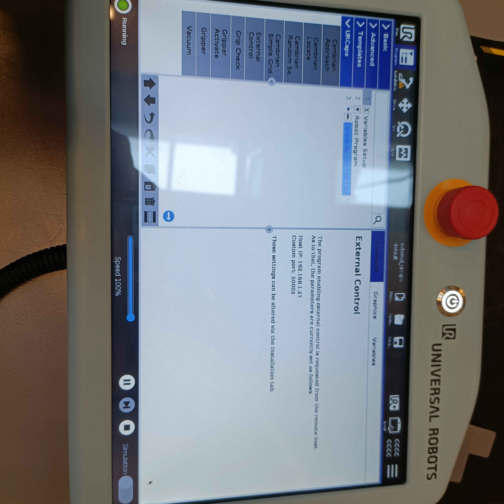
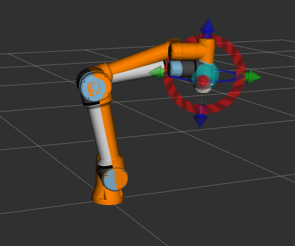

# ROB10
This is the repository of Christian Aleksander Hjorth's 10th semester Robotics project for Master Thesis.
## Description
The project consists of a robotic depalletizing solution. The aim of the project is robustly detect and estiamte the pose of boxes and proceed to pick and place them. 
## Installation
This repo makes use of the UR ROS2 driver and the moveit2 repo for ROS2 Humble

In order to use the Universsal Robot ROS2 driver go their github page and download from there or run:

`sudo apt-get install ros-humble-ur`

Then it is importnat to set a USB stick on the teach pendant and format it, however it will **ERASE** all of the data so be aware of that. 

After the usb is formatted it porbably won't be readble from your Ubuntu machine as it usually is then you need to do a few tricks to fix it.
 I got the following:

 `sudo mount /dev/sda1 /mnt/usb mount: /mnt/usb: wrong fs type, bad option, bad superblock on /dev/sda1, missing codepage or helper program, or other error. `

`christian@christian-Lenovo-Legion-Y540-15IRH:~$ sudo fsck /dev/sda1 `
`fsck from util-linux 2.37.2 e2fsck 1.46.5 (30-Dec-2021) ext2fs_open2: Bad magic number in super-block fsck.ext2: Superblock invalid, trying backup blocks... fsck.ext2: Bad magic number in super-block while trying to open /dev/sda1 The superblock could not be read or does not describe a valid ext2/ext3/ext4 filesystem.  If the device is valid and it really contains an ext2/ext3/ext4 filesystem (and not swap or ufs or something else), then the superblock is corrupt, and you might try running e2fsck with an alternate superblock: e2fsck -b 8193 <device> or e2fsck -b 32768 <device> `

`christian@christian-Lenovo-Legion-Y540-15IRH:~$ sudo umount /dev/sda1`
`umount: /dev/sda1: not mounted.`
`christian@christian-Lenovo-Legion-Y540-15IRH:~$ sudo mkfs.vfat -F 32 /dev/sda1 mkfs.fat 4.2 (2021-01-31)`

Sorry for the spam above, it might come in handy in the future, now we can proceed. It is now time to download the URCap file from their repo [URCaps](https://github.com/UniversalRobots/Universal_Robots_ExternalControl_URCap/releases) check for the latest relaease and wonload the .urcap file, for example _externalcontrol-1.0.5.urcap_ 
.Now paste the file on your USB stick and eject it safely from your pc. You can now put it on the teach pendant and find it, in the top right  burger menu, then go into _Settings_ then _URCaps_ and find the urcap file by pressing the plus (+) sign and pressing on it to open. Then the robot will ask to restart and you shold do so.

After it restarts, you should go to the installation folder and set the IP of the pc that will control the robot through ROS2. Then of course set that IP on you own pc, create a profile for example with the specific IP to make it easier. Example: 192.168.1.27 for the ROS2 pc. It is also important to set the robot's own IP to static as well not only the ROS2 pc, go ahead and do that, example 192.168.1.51

Make the robot calibration so the tool's center point is correctly aligned. To do that and extract its kinematics parameters, please run:
`ros2 launch ur_calibration calibration_correction.launch.py \
robot_ip:=<robot_ip> target_filename:="${HOME}/my_calibration.yaml"`

If you have MoveIt2 and UR's ROS2 driver installed you should be able to run the driver launch script, run, and remember to modify to your own needs, as of ip and params_file:

`ros2 launch ur_robot_driver ur_control.launch.py ur_type:=ur5e robot_ip:=192.168.1.51 launch_rviz:=true kinematics_params_file:='/home/christian/my_calibration.yaml'
`

**Go on the teach pendant and press to run a URCap program, with external control enabled, however it runs from local mode and then make sure to press the play button and after that it should be able to run now and receive commands!**

Now on a new terminal, run the moveit launcher of the driver, remember always to source before running any ROS related command:

`ros2 launch ur_moveit_config ur_moveit.launch.py ur_type:=ur5e launch_rviz:=true
`

Now you can drag around and plan with MoveIt! :D

Now you are ready to deploy it for your own applications!

## Development 
In this section the things devloped and their setup will be discussed and explained.

After that it is important to check the static address of the robot so you can connect to it as well